# Contributor Quick Start Guide

Utopian is the place where contributors converge, connect, collaborate and discover projects to work on. Quickly learn how to share the work that you are doing for an Open Source project with the community.

## Getting Started

To start sharing your work with the Utopian community, you’ll need to [create a Steem account](#). That is the Steem account you will login with on Utopian, using your private key (active or owner key, or master password) via the secure, Steemit Inc. operated signing service **[SteemConnect](https://v2.steemconnect.com/)**. Once you’re logged in, you can start making posts.

But before you start contributing, take some time and browse through the contributions on [Utopian.io](https://utopian.io) to get a feeling for what is possible and successful on the platform.

---

## The basics

 

### Your home page

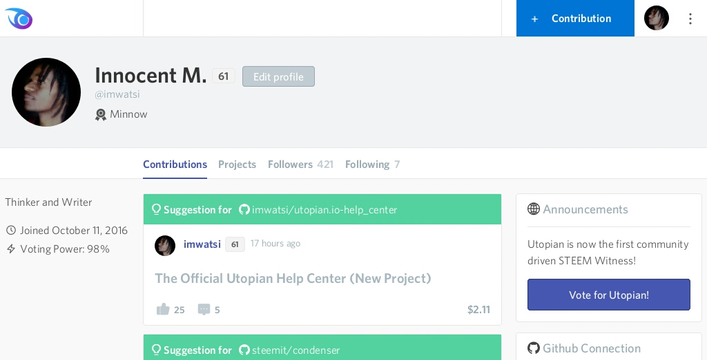

Your Utopian home page or profile page is like your dashboard, where you can see a list of all the contributions you’ve made and a brief summary of your profile. You can view your home page by clicking your profile picture avatar in the top right corner.

#### Contributions

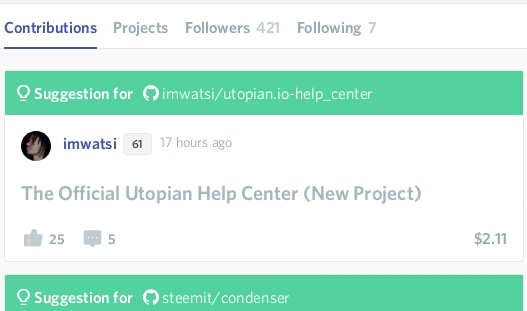

The section lists all the contributions you submitted to Utopian that **were reviewed and accepted by the moderators**. Each entry shows the contribution title, when it was published, the total number of likes and comments it has and how much it has earned in dollar terms. The number next to your username is your [reputation score](#).

#### GitHub integration

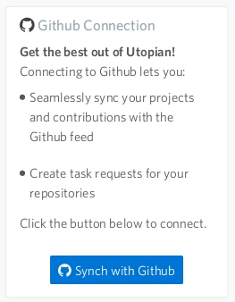

We recommend linking your GitHub account to your Utopian account so that you can easily reference your pull requests and projects, among other things. Your GitHub projects will show up here, if you’ve synchronized your account, or it will show you a button to synchronize your account if you haven’t. This section doesn’t show up when you’re using Utopian in mobile view. [Learn how to integrate your GitHub account](#).

#### User Profile

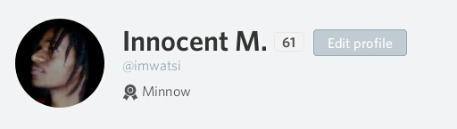

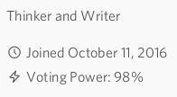

This section shows your name, profile picture, “about me” text, when your Steem account was created and your current [voting power](#).

 

### The menu

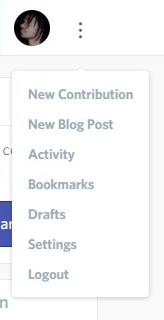

Located in the top right corner is the menu button, which gives you a list of useful actions you can take on Utopian.

#### New contribution

This takes you to a page where you can begin writing a new post. [Learn how to write a new post](#).

#### New blog post

Write a new blog post about Open Source related reflections, opinions or events.

#### Activity

See your Steem account’s activity in detail, on [steemd.com](#).

#### Bookmarks

See a list of posts that you have bookmarked in Utopian. [Learn how to bookmark a post](#).

#### Drafts

Utopian saves drafts of posts as you write them, so that you don’t lose your work. Clicking this menu item will take you to where your drafts are saved.

#### Settings

Go to the settings page to customize your experience.

#### Logout

This signs you out of Utopian. When signing back in, you will be redirected to SteemConnect.

 

### The Utopian feed

Clicking on the Utopian logo in the top left corner, or clicking “Contributions” in the left sidemenu, will take you to the Utopian feed, where you will find a list of all the recent contributions made on Utopian. Each contribution item shows the contribution tile, its author, the total number of likes and comments it received and how much it has earned in dollars.

#### Filtering the contributions list

You can filter your list by choosing a category from the menu just above the contributions list:

The options consist of categories into which contributions are made, such as: Suggestions, Sub-Projects, Development, Bug Hunting, etc.

#### The sidemenu

When browsing Utopian on laptop or desktop, a sidemenu appears to the left of the screen:

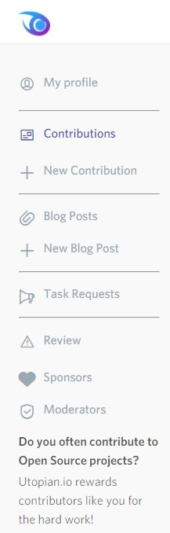

This menu gives quick access to useful areas of the site such as your contributions, blog posts and a link to where you can find task requests. [Learn more about task requests](#).

 

### Search

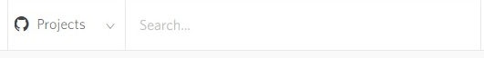

A search bar is located right at the top of the page and you can use it to search for projects or contributions in various categories. Use it to find projects or contributions by keyword, or to find something specific.

 

### Settings

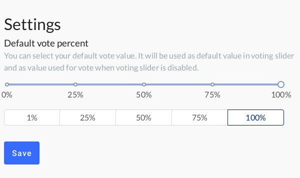

This page allows you to customize your experience on Utopian. Currently, there is only the option to change the language, but more options will be made available soon. Utopian is rapidly developing and many changes are planned as it transitions to Version 2.

 

### The chat feature

Utopian has a chat feature that makes it possible to communicate in real time with project owners and other contributors you’re working with. Click the blue chat button in the bottom-right of the page to start chatting.

---

## Making a contribution

 

To start writing a post, click on the blue button with a **+** that’s in the top right area of the page

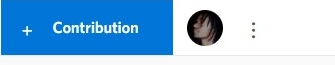

or click **+ New Contribution** in the left side menu

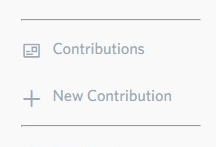

or click **New Contribution** in the top right menu

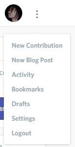

You will be taken to a page where you are asked to choose a category. Pick the category that’s most suitable for your contribution. You can read the rules that are shown for each category to make the right decision. Once you’ve picked the right category, click **I understand. Proceed.**

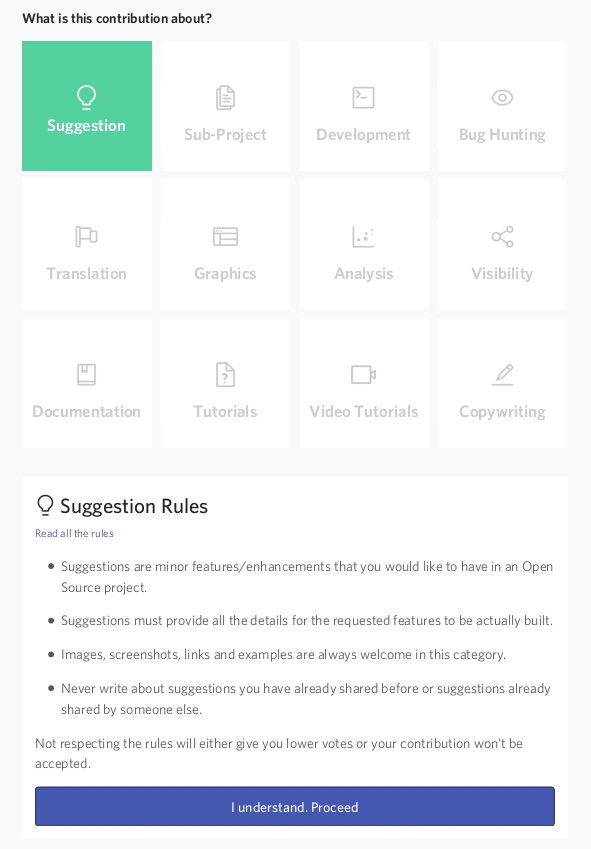

This will take you to a page where you can write your post and input all the other metadata that’s needed.

 

### Choose GitHub Project

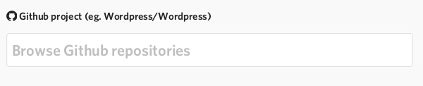

The first field you’ll see on the page is for the **GitHub Project** that you are contributing to. Enter keywords included in the GitHub repository name of the Open Source project you are writing about and press enter to choose from a list of projects pulled from GitHub.

 

### Select pull requests (optional)

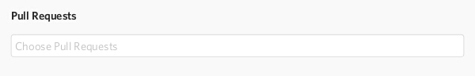

If you’ve submitted pull requests to the project, a list of all the pull requests you submitted on GitHub will show up here. Choose the ones that are directly related to the work you are writing about.

 

### Title of your contribution

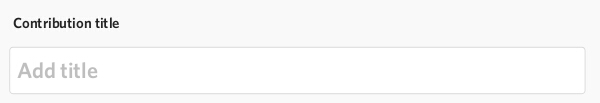

Next, you’ll have to type in the title of your contribution. [Learn about the best practices of writing Contribution Titles](#).

 

### Write the post

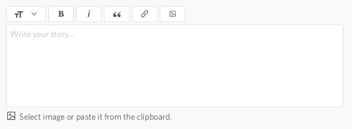

This area is where you will compose your contribution. You can enter text, upload images and format your text with a wide variety of options. The editor also accepts markdown and some HTML. [Learn how to format your text using markdown or HTML](#).

A preview of how your post looks will appear beneath the page. It is updated as you make changes and a draft is automatically saved to reduce the risk of losing your work.

 

### Add tags

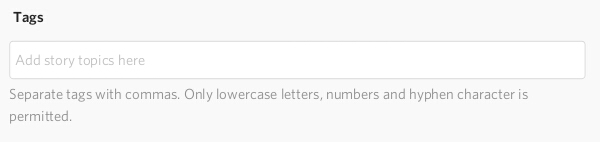

Tags allow your post to be searchable on Utopian and it is necessary to only use tags that are relevant to the contribution you are making. Examples of tags are: _bugs, design, logo, copywriting or translation_.

 

### Choose your reward option

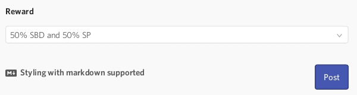

Utopian gives you two ways in which to receive your STEEM rewards.

#### 1) 50% SBD, 50% STEEM POWER (default)

This option gives you 50% of your rewards in SBD, which is a form of liquid STEEM. It can be transferred and spent immediately. You can trade it for Bitcoin or any other cryptocurrency, and ultimately exchange it for the fiat currency of your choice.

The other 50% will be in Steem Power, which is STEEM that is bound to a smart contract that lets you withdraw your STEEM in 13 weekly amounts. Steem Power has a lot of utility in the Utopian ecosystem, and [more information about its importance is available in the knowledge base](#).

#### 2) 100% STEEM POWER

This option gives you all your rewards in the form of Steem Power, which you can withdraw through a 13 week schedule by “powering down” your Steem account. [Learn more about the Steem blockchain’s economic model](#).

 

### Submitting the contribution

Once you’re done writing your contribution and have added enough metadata, and selected your reward option, you can now submit your contribution to the Utopian moderation team by scrolling to the bottom of the page and clicking **Post**.

If you have left out any important fields or entered incorrect data, your submission will not go through. The relevant fields will be highlighted in red and an explanation of the error shown next to them.

If all the required fields are met, your contribution will be placed in queue to be reviewed by the moderators. You’ll see a message on the page informing you of this, as shown in the image below. [Learn why Utopian has moderators.](#)

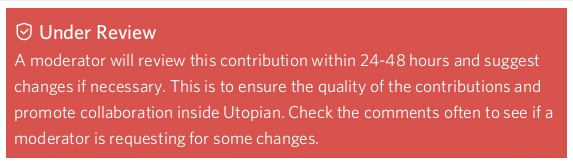

---

## The review process

 

When your contribution has been submitted successfully, expect your work to be reviewed by one of Utopian’s moderators within a few hours. Moderators check your submission for compliance with Utopian’s rules and quality expectations. They will leave a comment on your post if your submission needs to be corrected in any way.

 

### Common reasons for moderator rejection include:

*   Wrong category: you placed your contribution in the wrong category and will need to change it to the correct one
*   Duplicate submission: your submission is for work or an issue that you or someone else has already submitted before (common with bug reports)
*   Failure to meet quality expectations: every category has its own expectations for quality with some categories requiring specific content like pull requests, charts, links or other things that compile to form a complete submission with sufficient proof of work.

 

### Responding to moderator requests

Your new post will be listed on your home page, under **Contributions**. Open it and check if there are any new replies to your post. Moderators write a comment on your post with instructions on how to correct your submission.

To edit your post, click the **...** menu button near the post title, and select **Edit post**.

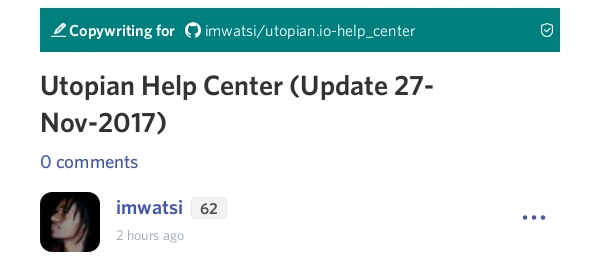

You'll be taken back to the editor where you can make the necessary changes. Once you're done editing, scroll to the bottom and click **Update post**.

Your post will be reviewed again and when it has been accepted, a moderator will leave a comment saying so, as seen in the screenshot below:

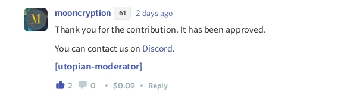

---

## Your accepted contribution

 

Once your contribution is accepted, it will be visible to the Utopian community and eligible for being upvoted by the Utopian bot. It will be published on the Steem blockchain and will forever be available on the blockchain.

 

### How much will it make?

*   Every post that is approved by Utopian moderators has the chance to be rewarded by the Utopian voting bot. It uses algorithms to calculate the rewards that are given to each new contribution in relation to other contributions. Utopian has over 3 million Steem Power allocated to rewarding contributors and every contribution gets a share. Other opportunities to earn exist. Members of the community can also upvote your content and project owners can send you STEEM as rewards.
*   How much a post earns depends on many variables, which include the category it falls under and the quality of the content. Ultimately, how much your contribution makes is determined mostly by the quality of your work, how it is received by the community and other agreements you may have with project owners.

 

### When you will get paid

*   The Steem blockchain distributes rewards to contributors automatically, seven days after the day on which the post was published.
*   Depending on the rewards option you choose when publishing the post, your rewards will either be in Steem Power alone or both Steem Power and Steem Blockchain Dollars (SBD). Both of these can be traded for other cryptocurrencies on exchanges, though Steem Power requires more time to withdraw. [Learn more about managing your STEEM wallet](#)
