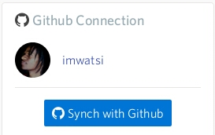
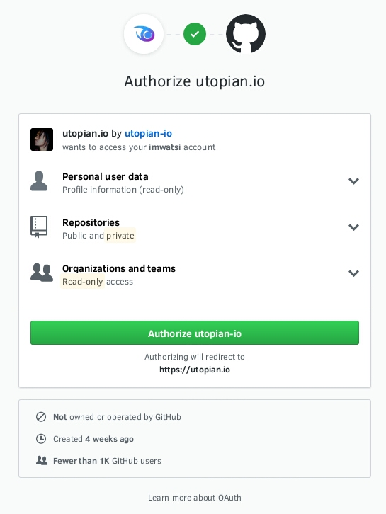
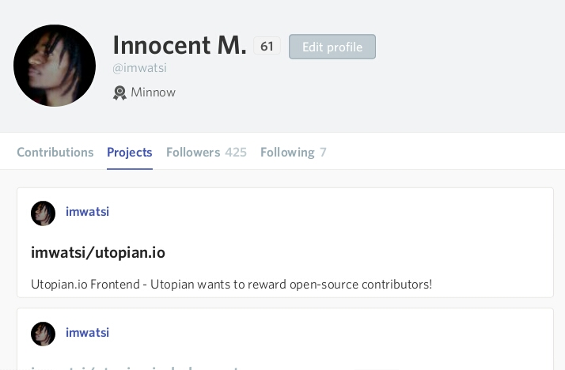
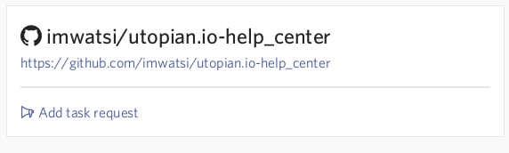
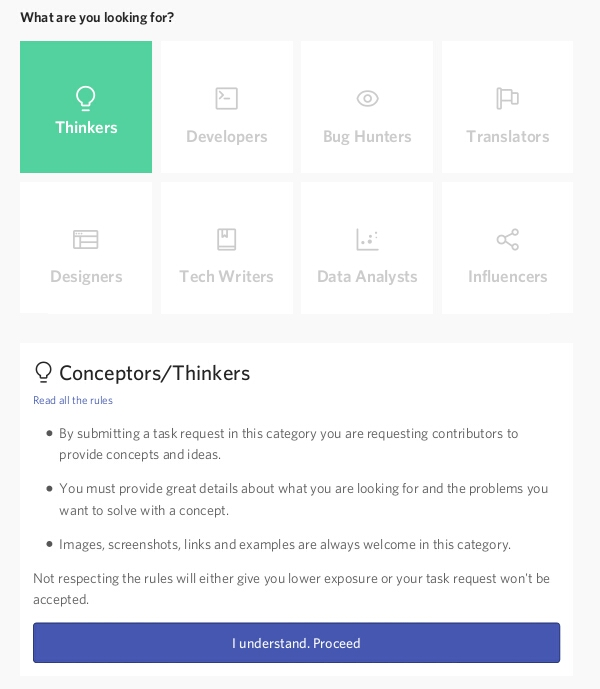
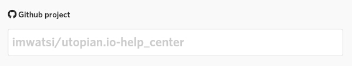
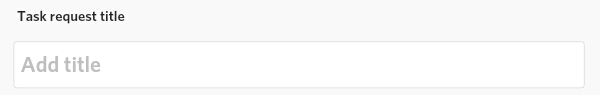
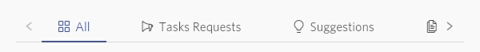
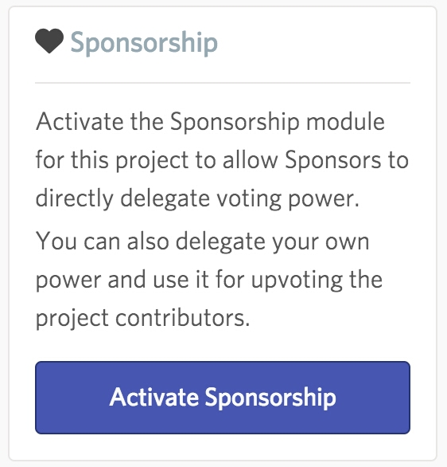

# Project Owner Quick Start Guide

Utopian helps connect project owners with valuable contributors, expediting the project development process. Make task requests for your project and find the right people to work with.

## Getting Started

To bring your project to the Utopian community, you first need to [create a Steem account](#). This is the Steem account you will login with on Utopian, using your private key (active or owner key, or master password) via the secure, Steemit Inc. operated signing service **SteemConnect**.

---

## Link your GitHub account

Once your Steem account is setup and you’ve successfully logged in, the next step is to link your GitHub account with your Utopian account. To do this, go to the **GitHub Connection** section, in the right side panel, and click **Synch with GitHub**.

This will take you to the following screen, if you are already logged in to GitHub:

_If you’re not logged in to GitHub, you will be asked to sign in._

This asks you to verify that you are giving Utopian access to your GitHub account. It also lists the types of data that Utopian will have access to. To continue synchronizing your account, click **Authorize utopian-io**.

It should take a few seconds to link your accounts and you will be brought to your Projects page afterwards, where all your repositories will now be listed.

---

## Your projects

To make your way to the Projects page from elsewhere on Utopian, click the **Projects** tab on the navigation menu. The Projects page will open, listing all the projects/repositories you currently have on GitHub.

Clicking an individual project will take you to that particular project’s page, where you’ll find all the project’s activities, which include task requests you’ve made and contributions submitted. You will also have the option to create a new task request for the project.

---

## Creating a task request

A task request is an announcement you make detailing what your project needs and how contributors can help you get it done.

To create a new task request, click “Add task request” near the name of the project you’re viewing, at the top of the page.

Note: You must be on your project’s page, as described above, to see the option to add a task request for it. You can also click the blue icon beside your project’s name, in the “GitHub Connection” section, on the right side of the page.

Next, you will be asked what you want contributors to do for your project. You can create task requests addressed to contributors specialized in many different areas, as seen in the image below.

Choose the one most appropriate for your task request and read the rules so that your task request will be accepted by the moderators.

Once you have read the rules and understood them, click **I understand. Proceed.** You'll be taken to the task request editor.

[Learn more about creating effective task requests](#)

 

### The editor

 

#### GitHub project

The GitHub project you’re creating a task request for will be displayed here. This field is disabled by default. To change the project, leave the editor and select another project from the list on your **Projects** page.

 

#### Write the title

Write the title of your task request here. Make sure your it relates to potential contributors by writing text that clearly portrays overall purpose of the task request. [Read tips on writing effective titles for your task requests](#).

 

#### Write the post

This is where you will write your task request. You can format text with a number of options, upload pictures and link to other sites. You can also [use Markdown or HTML to format your post](#).

Your task request should have enough information to let potential contributors know what your project needs and how they can contribute. Read more about [writing an effective task request](#).

 

#### Add tags

Add tags that are relevant to your task request here. Tags are usually one or two word phrases that categorize your task request. If using two word phrases, you can join the words using a hyphen. Examples include _brainstorming, logo-design, how-to, testing, bug-hunting._

 

#### Choose your reward option

Utopian gives you two ways in which to receive your STEEM rewards.

**1) 50% SBD, 50% STEEM POWER (default)**

This option gives you 50% of your rewards in SBD, which is a form of liquid STEEM. It can be transferred and spent immediately. You can trade it for Bitcoin or any other cryptocurrency, and ultimately exchange it for the fiat currency of your choice.

The other 50% will be in Steem Power, which is STEEM that is bound to a smart contract that lets you withdraw your STEEM in 13 weekly amounts. Steem Power has a lot of utility in the Utopian ecosystem, and [more information about its importance is available in the knowledge base](#).

**2) 100% STEEM POWER**

This option gives you all your rewards in the form of Steem Power, which you can withdraw through a 13 week schedule by “powering down” your Steem account. [Learn more about the Steem blockchain’s economic model](#).

 

#### Submit the task request

Once you’re done writing your task request, click **Post** to submit it for review by moderators. When your task request has been submitted successfully, expect your work to be reviewed by one of Utopian’s moderators within a few hours. Moderators check your submission for compliance with Utopian’s rules and quality expectations.

They will leave a comment on your post if your submission needs to be corrected in any way. Otherwise, your submission will be approved and become visible to the Utopian community.

 

### Contributor responses

Your approved task request will be visible to contributors on Utopian and people browsing task requests by category can see your post. Interested contributors may get in touch with you and comment on your post or contact you via chat. Depending on the nature of your task request, some might start submitting contributions to your project.

You can view the contributions made to any of your projects by navigating to the **Projects** page (as explained above) and selecting the individual project.

---

## The chat feature

Utopian has a chat feature that makes it possible to communicate in real time with the contributors you’re working with. Click the blue chat button in the bottom-right of the page to start chatting.

---

## Viewing the contributions

On a particular project’s page, you can view all contributions made to it and filter your results by category. Just choose what you want to see on the navigation menu.

Using Utopian, you can manage all the work done and collaborate with the people working on your project through a combination of task requests and contributions.

---

## Rewarding contributions

Utopian rewards every contribution that passes moderator review and gets published. The platform also gives project owners the opportunity to increase the rewards distributed to their contributors through the Sponsorship module.

 

### Sponsorship module

Rewards on the Steem blockchain are passed on to other people through voting, and the amount of [Steem Power](#) an account has affects the power of its vote. The more the Steem Power, the more valuable the vote is.

The Sponsorship module (found on the right side of the screen) enables project owners to increase rewards by allowing them or other sponsors to delegate Steem Power to their project. In order to delegate Steem Power, an account must be powered up first.

To power up a Steem account, one needs to buy STEEM tokens and then transfer them to his/her account, and then commit that STEEM to a 13 week vesting contract which is called **Steem Power**. [Learn how to power up your Steem account](#) or [How to activate Sponsorship for your project](#).

 

### Sending STEEM tokens

Project owners can also choose to send STEEM tokens to contributors as way of payment or reward. These will come directly from the project owners accounts and not from the general rewards pool of Steem. [Learn how to transfer STEEM tokens](#).
