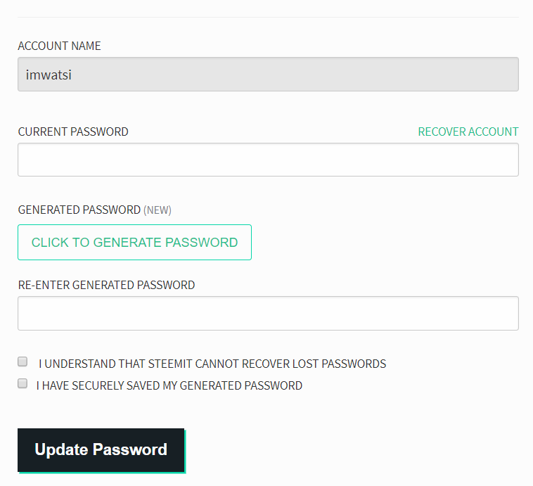

# Changing your master password/owner key

As a security feature, the Steem blockchain allows you to change your Steem account's owner key or master password. This can be useful when you suspect that your account's private keys may have been compromised and need to change them all to secure your account before any harm is done.

To change your Steem account's owner key, follow these steps:

- Go to [steemit.com](https://www.steemit.com) and open the wallet page by clicking "Wallet" on the menu. You need to be logged in to change your password.

- Click on "Password" in the menu below the main one.

- Fill in the fields in the form to change your Password:

**Account Name:** displays your current Steem account user name and it cannot be changed.

**Current Password:** enter the current master password or owner key of your Steem Account.

**Generated Password:** to generate a new, secure password or owner key for your account, click the "GENERATE NEW PASSWORD" button. A new password will be created for you. Copy this new password and store it in a secure place before proceeding.

**Re-enter Generated Password:** enter the new password in this field to complete the password change process. Make sure you have a secure backup copy of the new password that was generated.

**Tick the two confirmation boxes:** confirm that you understand that Steemit cannot recover your password if you lose it and that you have securely stored it.

**Update Password:** click this button to complete the password change process.

---

*After clicking the "Update Password" button, you will be notified that the password has been changed. This process also changes all the other private keys associated with your Steem account. Make sure you don't lose your backup and always keep your private keys private.*
