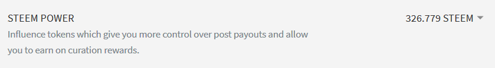
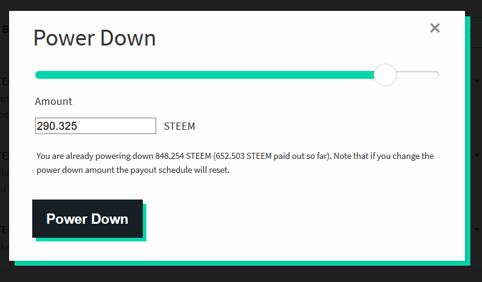

# Powering down your Steem Account

Steem Power can be released from the 13 week vesting contract through a process called "powering down." This transforms your Steem Power into liquid STEEM that can be transferred at any time. The Steem Power is withdrawn over a period of 13 weeks, in 13 amounts that total the amount you select.

To power down your Steem account, follow these steps:

1) Go to [steemit.com](https://www.steemit.com) and open the wallet page by clicking "Wallet" on the menu. Please note that you need to be logged in to power down your account.

2) Go down to the section where your account's Steem Power is shown and click the arrow near the amount.

3) A menu will appear. Click **Power Down**, as shown below:

4) A new window will be shown. Select the amount of Steem Power you would like to power down by using the slider or entering an amount in the text box. After you're done, click the **Power Down** button

5) You'll be asked to enter your *owner key* or *active key* to authenticate the transaction.

*After initiating the power down process, a countdown begins and the first of 13 weekly withdrawals will occur in 7 days. You can also stop your power down at any time by clicking "Cancel Power Down" as shown in the screenshot in Step 3.*
