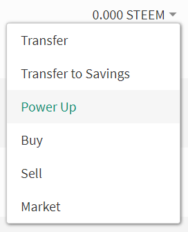
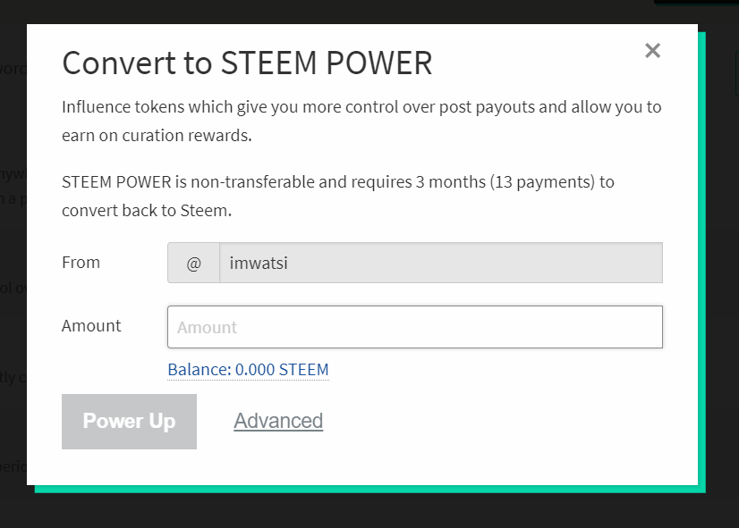
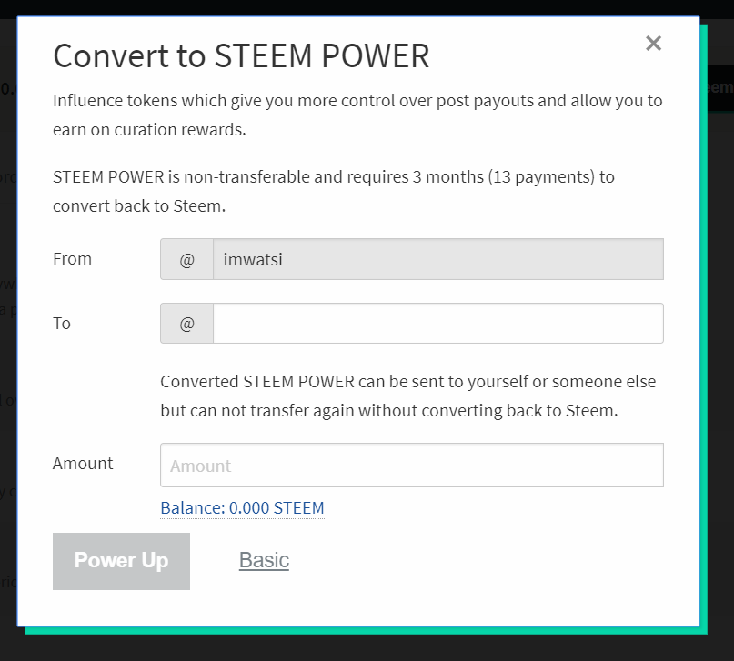

# Powering up your Steem Account

The Steem Power that an account holds can be increased through a process called "Powering Up." This involves turning liquid STEEM into Steem Power. If your account already has STEEM to use in this process, then following the steps below will power up your account with the amount of STEEM you choose.

- Go to your Steem account on steemit.com and click **Wallet**

- Click the dropdown beside your STEEM balance and choose the **Power up** option

- Enter the amount of STEEM you wish to power up and click **Power up**

## Acquiring more STEEM

If your account doesn't have enough STEEM to power up, there are a number of ways in which you can acquire STEEM to power up with:

### 1) Buy Steem Power from Blocktrades

Blocktrades is an exchange accessible from within the Steem Wallet, and it facilitates the exchange of various cryptocurrencies for the any of the three native currencies of the Steem Blockchain (STEEM, SBD or Steem Power).

It offers an option to exchange one cryptocurrency for Steem Power, that will be powered up directly to your Steem account. To take this option, visit [Blocktrades](https://blocktrades.us/?input_coin_type=eth&output_coin_type=steem_power) and initiate an exchange, with *Steem Power* as your output cryptocurrency.

### 2) Buy Steem and Power Up

STEEM can be purchased from cryptocurrency exchanges, withdrawn and sent to your Steem wallet and used to power up your account. Below is a list of cryptocurrency exchanges where STEEM is available:

- [Blocktrades](https://blocktrades.us/?input_coin_type=eth&output_coin_type=steem)
- [Bittrex](https://bittrex.com/Market/Index?MarketName=BTC-STEEM)
- [Binance](https://www.binance.com/trade.html?symbol=STEEM_BTC)
- [Upbit](https://upbit.com/exchange?code=CRIX.UPBIT.BTC-STEEM)
- [Poloniex](https://poloniex.com/exchange/#btc_steem)
- [GOPAX](https://www.gopax.co.kr/exchange?market=STEEM/KRW)

## Power up using another Steem Account

One Steem account can also power up another one by converting STEEM to Steem Power. To do this:

- Go through the steps described above to get to the power up window.

- Click **Advanced** and the window will expand to include more details.

- Write the name of the account you wish to power up in the field labelled **To**.

*The STEEM you power up is vested in a smart contract, and it can only be withdrawn through 13 weekly withdrawals.*
